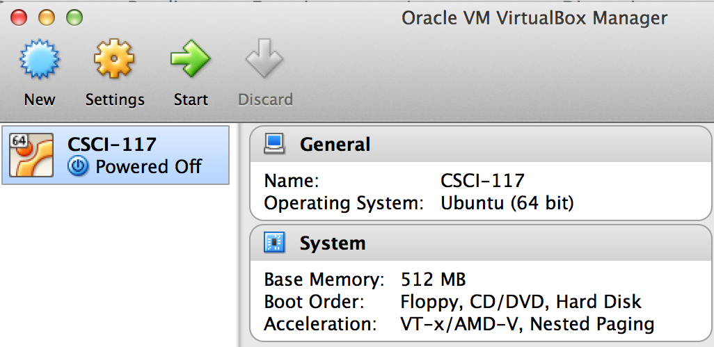
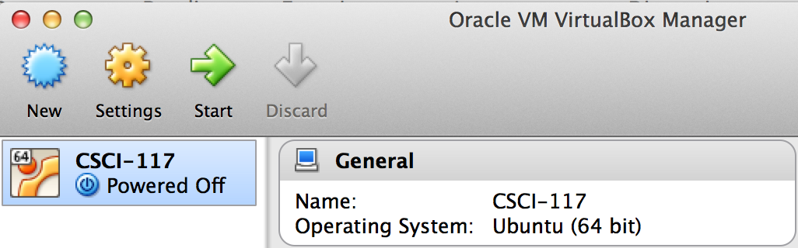
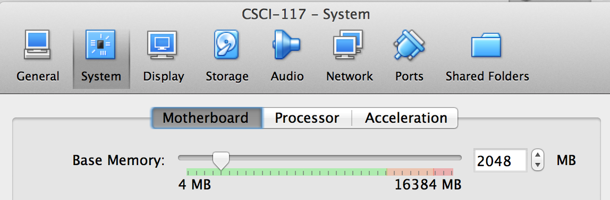
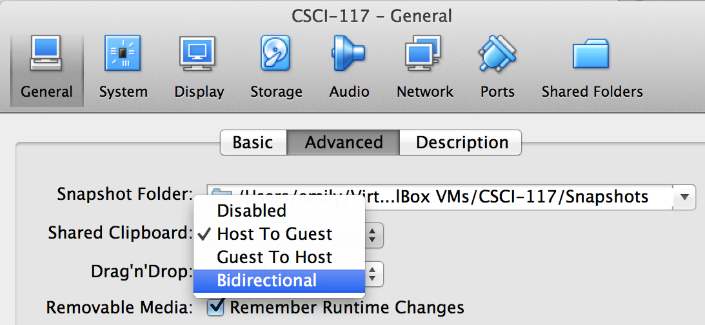

# UNIX Python Development Setup for Windows

I have already setup a UNIX installation for you, but to use it, you need to set it up in Virtual Machine software such as Virtual Box or VMware player.

1. Download and install [VMware player](https://www.vmware.com/products/player/playerpro-evaluation.html) (recommended for Windows) or [VirtualBox](https://www.virtualbox.org/) (recommended for Mac) on your computer.
1. Download the [VM image file `CSCI-150.ova`](http://cs.drew.edu/~emhill/vm-images/CSCI-150.ova) (~2GB). 
1. Install, run, shutdown, & customize your VM (detailed steps below).

## Install VirtualBox & CSCI 150 VM

Steps:

  1. Install Virtual Box & open it
  - Once your virtual machine (VM) image file `CSCI-150.ova` has completed downloading (it should be about 2 GB), go to `File > Import Appliance` in VirtualBox. On VMWare Player, go to `Open a Virtual Machine`.
  - Browse to the `CSCI-150.ova` file on your computer, select `open` and then `Import`.
  - Once imported, you should see the CSCI-150 virtual machine powered off: 
  
  - Hit the green arrow (labeled `Start` on VirtualBox, `Play virtual machine` on VMware Player) to boot the UNIX machine. *Note*: If you get a `VT-X error`, you can either turn on virtualization through BIOS ***OR*** import the [32-bit version of the VM image](http://cs.drew.edu/~emhill/vm-images/CSCI-150-32bit.ova) in your Virtual Machine. See me during office hours for help.
  - **VirtualBox only:** Once the UNIX VM has loaded, go to `Devices > Insert Guest Additions CD image`. (On VMware Player, this would be `Player > Manage > Install VMware Tools`, but it should already be installed.)
  - You may need to enter the user name and/or password for this machine:
     - **user**: csci
     - **password**: drew

You can also watch this screencast to install & setup your VirtualBox VM:
 


## Shutdown the VM

When you're finished, you should shutdown your VM.



You have three choices of what to do with your VM state:

1. `Save virtual machine state` means the next time you resume, the VM will be exactly as you left it, like standby/resume on your host computer. 
1. `Send shutdown signal` will shut down the VM's (guest) OS in an orderly way; your changes will be saved, but the next time you restart the VM, any programs that were running in the VM will have been shut down.  This is like using the shutdown command on your host computer.
1. `Power off`  is like pulling the plug on the VM, and there is a risk that some data may be lost.  This option is not recommended except as a last resort if the other options don't work.

## Customize your VM

Finally, you should customize your VirtualBox.



1. Hit the orange cog wheel labeled `Settings` in the <a href="VBMgr-full.png">main VirtualBox Window: 
</a>

2. Go to `System` and add more base memory. At least 1024 MB is recommended, but no more than 25% of your total RAM (otherwise your host machine will be noticeably slower while the VM is running). 

2. Next got to `General > Advanced` to enable a bidirectional shared clipboard: 
 
This will allow you to copy/paste between your host computer and the virtual machine. *Note:* if you’re copying from or pasting to a terminal window within the VM then you should use Ctrl+Shift-C, Ctrl+Shift-V instead of the more usual Ctrl-C and Ctrl-V.

3. You can also enable Drag'n'Drop support to transfer files between your host computer and your VM.

<!--1. Run VirtualBox and click the New button to create a new VM. 
1. When the VM Wizard appears, select the following options:
        operating system: Linux
        version: Ubuntu
        RAM base memory: at least 1024 MB is recommended
        Select "Use existing hard disk" and choose the .vdi file you downloaded in step 2
    This screencast explains how to set up, boot and log in to the VM. 
1. Make sure you have network access by opening the Firefox browser (icon located along left screen edge when VM is running) and visiting a popular site such as Google.com.
2. Install VM Guest Additions: In VirtualBox, choose Devices > Insert Guest Additions CD image… -->
<!--1. Highly recommended: enable Shared Folders and Copy/Paste, which allows you to view and edit files residing in the VM image using an editor on your host computer and to copy and paste text between the VM and your host computer.
    - On the popup window click Run button, after that give the password (saasbook) and click on the Authenticate button.
    - In VirtualBox, choose Devices > Shared Clipboard > Bidirectional
    - This will allow you to do copy and paste between your host computer and the virtual machine. *Note:* if you’re copying from or pasting to a terminal window within the VM then you should use Ctrl+Shift-C, Ctrl+Shift-V instead of the more usual Ctrl-C and Ctrl-V.-->

## Using the VM

A typical work session using the VirtualBox VM proceeds as follows:

- Start VirtualBox, select the CSCI-150 VM, and click the Start button.
- Do your work.
- When you're ready to quit, select `Close` from the VirtualBox Machine menu and shutdown using your preferred method (saved state or shutdown)

