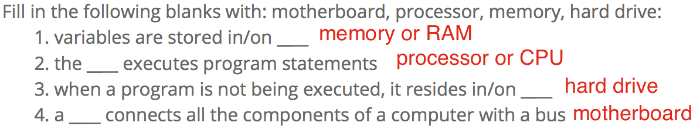
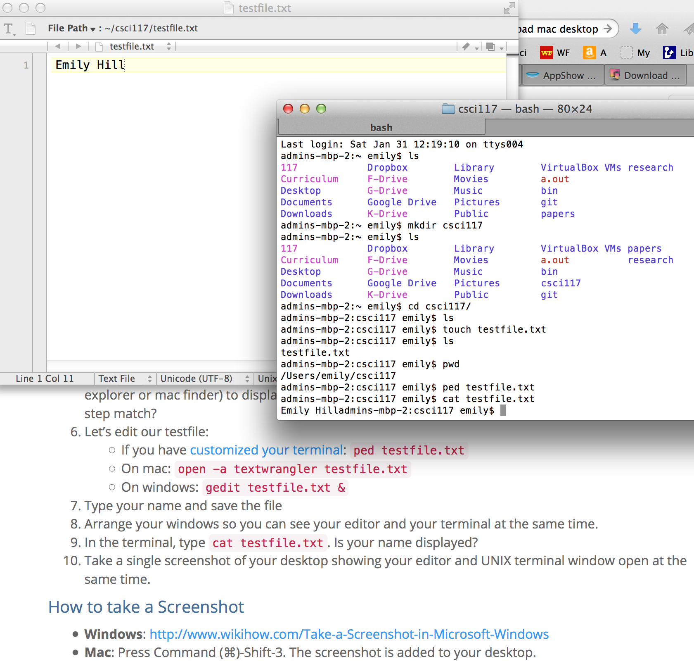

# Practice HW1: UNIX & Hardware



## Exploring Hardware & Binary

1. How many pieces of information can be conveyed with a single bit?
1. How many bits would you need to represent each of the 50 United States using a unique permutation of bits?
1. How many bits are in a byte?
1. What is the binary representation of the number 3?
1. What is the encoding standard used to convert text into ordinal numbers?
1. Fill in the following blanks with: motherboard, processor, memory, hard drive:
    1. variables are stored in/on ________
    1. the ________ executes program statements
    1. when a program is not being executed, it resides in/on ________
    1. a ________ connects all the components of a computer with a bus

## Exploring the UNIX command line

Read through the following tutorial: [http://www.davidbaumgold.com/tutorials/command-line/](http://www.davidbaumgold.com/tutorials/command-line/). Then, open your UNIX terminal and go through the following steps.

1. Let’s create a directory for this class. Type `mkdir csci117`.
1. Type `cd csci117` to move the terminal to that directory
1. Type `touch testfile.txt` to create an empty file
1. Type `ls` in the terminal. Do you see testfile.txt?
1. Type `pwd` to see what directory your terminal is in, then try to navigate your computer’s GUI (window’s explorer or mac finder) to display that directory. Do the GUI folder and terminal listing from the prior step match?
1. Let’s edit our testfile:
    - If you have [customized your terminal](unix-custom.html): `ped testfile.txt`
    - On mac: `open -a textwrangler testfile.txt`
    - On windows virtual box: `gedit testfile.txt &`
1. Type your name and save the file
1. Arrange your windows so you can see your editor and your terminal at the same time.
1. In the terminal, type `cat testfile.txt`. Is your name displayed?
1. Take a single screenshot of your desktop showing your editor and UNIX terminal window open at the same time.

#### How to take a Screenshot
 - **Windows**: [http://www.wikihow.com/Take-a-Screenshot-in-Microsoft-Windows](http://www.wikihow.com/Take-a-Screenshot-in-Microsoft-Windows)
 - **Mac**: Press Command (⌘)-Shift-3. The screenshot is added to your desktop.

## Demonstration

Once you've finished doing the HW a single time, watch me do it:





### Solutions to Hardware Questions

### My Final UNIX Screenshot

