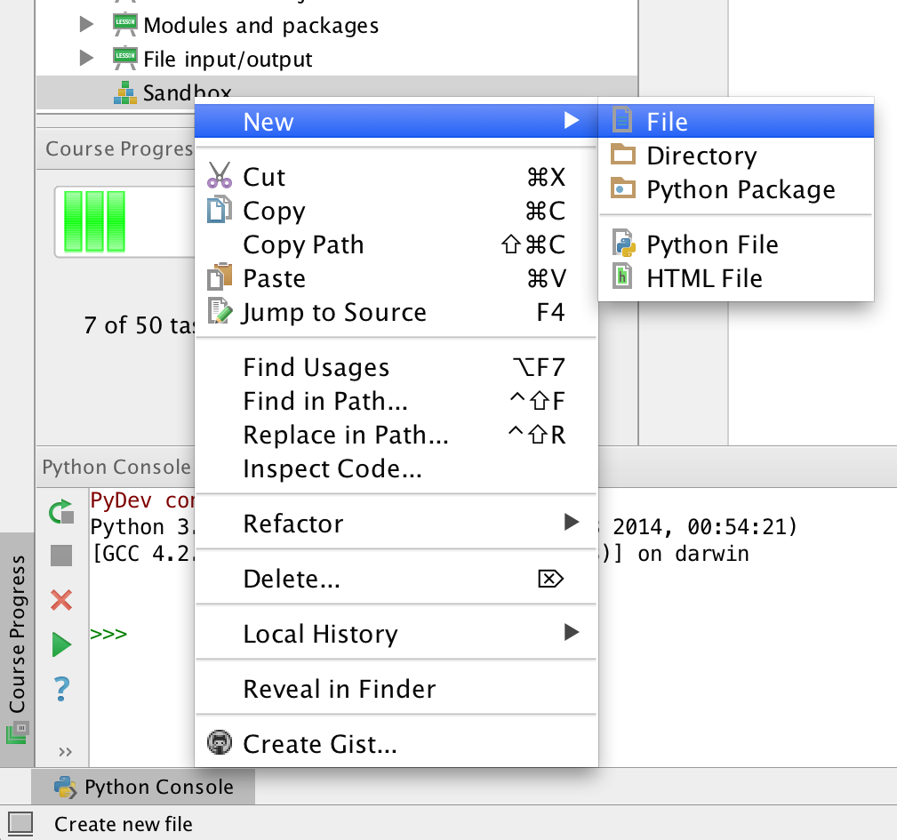
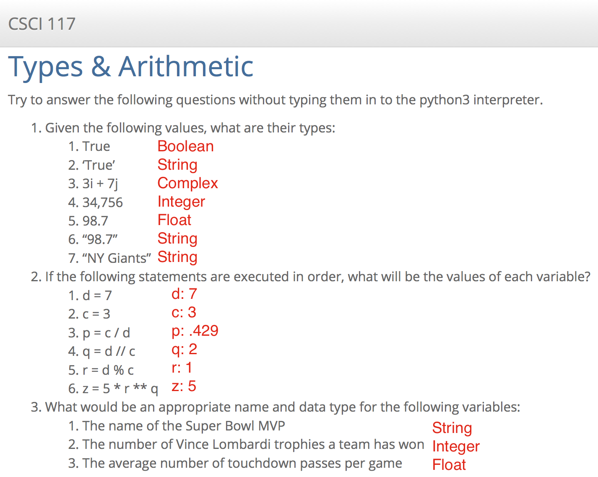

# HW: Syntax & Variables

## A simple python program

1. Open PyCharm, and from the project listing in the upper left select "Sandbox".
2. Right-click and create a new program file called `hello_me.py`:
3. 
3. Double-click the file to open it.
4. Edit the file:
    4. Create a variable to store your first name
    1. Print "Hello, my name is ..." and replace the ellipsis (...) with the variable that is storing your first name.
    1. Add a comment at the top of the file that explains what your program does.
4. Run your python program.
5. Create a second program called `tips.py`, that:
    1. Has 4 variables:
        * meal: holds the value of the meal ($53.48)
        * tax: holds the tax percentage (7%)
        * tip: holds the tip percentage (18%)
        * total: holds the total of the meal. Proper tipping technique dictates that the tip should be calculated based on the total cost of the meal, before tax is applied.
    1. Prints the contents of the total variable with a leading dollar sign ($).
4. Run your tips program. The total should be `$66.85`
5. Once you're satisfied that your programs are working correctly, take a screenshot of each program open in the editor, with its output displayed in the console, and submit to google classroom. You should submit 2 screenshots.

## Types & Arithmetic

Try to answer the following questions without typing them in to the `python3` interpreter, as you would on an exam or quiz.

1. Given the following values, what are their types:
    1. True
    1. 'True'
    1. 3 + 7j
    1. 34,756
    1. 98.7
    1. "98.7"
    1. "NY Giants"
2. If the following statements are executed in order, what will be the values of each variable?
    1. d = 7
    1. c = 3
    1. p = c / d
    1. q = d // c
    1. r = d % c
    1. z = 5 * r ** q
3. What would be an appropriate name and data type for the following variables:
    1. The name of the Super Bowl MVP
    1. The number of Vince Lombardi trophies a team has won
    1. The average number of touchdown passes per game

These should be submitted by typing them into Google classroom directly or by submitting a google doc.

<!--## Submission-->

<!--

## Solutions to Questions

 -->