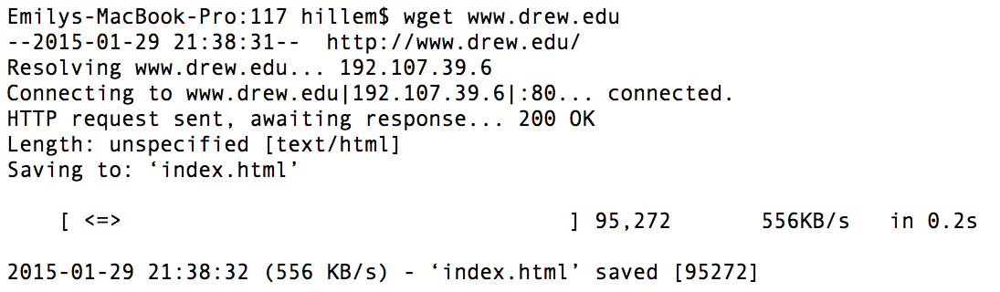
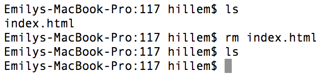

# HW: UNIX, Hardware, & Binary

<!---->

## UNIX Setup

The first step is to get access to a UNIX command line.

### Mac Users

Good news! Macs come with UNIX built-in, although you will still need to install python & a good text editor. Follow [these installation instructions](install-mac.html) and then [customized your terminal](unix-custom.html).

If the above steps don't work for your mac, you can follow the directions for Windows users, below.

### Windows Users

Windows users (and some mac users) will need to install a program called VirtualBox, which allows you to run UNIX inside of any other host operating system (OS). It's like having another computer running virtually *inside* your Windows machine. Follow [these installation instructions](install-windows.html) to setup.

## Exploring the UNIX command line

Read through the following tutorial: [http://www.davidbaumgold.com/tutorials/command-line/](http://www.davidbaumgold.com/tutorials/command-line/). Then, open your UNIX terminal and go through the following steps.

1. Let’s create a directory for this class. Type `mkdir csci117`.
1. Type `cd csci117` to move the terminal to that directory
1. Type `touch testfile.txt` to create an empty file
1. Type `ls` in the terminal. Do you see testfile.txt?
1. Type `pwd` to see what directory your terminal is in, then try to navigate your computer’s GUI (window’s explorer or mac finder) to display that directory. Do the GUI folder and terminal listing from the prior step match?
1. Let’s edit our testfile:
    - If you have [customized your terminal](unix-custom.html): `ped testfile.txt`
    - On mac: `open -a textwrangler testfile.txt`
    - On windows virtual box: `gedit testfile.txt &`
1. Type your name and save the file
1. Arrange your windows so you can see your editor and your terminal at the same time.
1. In the terminal, type `cat testfile.txt`. Is your name displayed?
1. Take a single screenshot of your desktop showing your editor and UNIX terminal window open at the same time.

## Exploring Hardware

Fill in the following blanks with: motherboard, processor, memory, hard drive:

  1. variables are stored in/on ________
  1. the ________ executes program statements
  1. when a program is not being executed, it resides in/on ________
  1. a ________ connects all the components of a computer with a bus

## Running your first python program

In a graded HW or project, I would give you directions like this:

1. Create a folder (`mkdir phw1_uLogin`) where you replace `uLogin` with your Drew e-mail address before the @ sign.
2. Go into this folder by typing `cd phw1_uLogin` and create a python file: `touch hello_world.py`
3. Edit the file (`ped hello_world.py`) to print "Hello, World!". *Make sure to save your file.*
4. Run your python program: `python3 hello_world.py`
5. Once you're satisfied that your program is working correctly, zip it for submission:
    - `cd ..`
    - `zip phw1_uLogin.zip phw1_uLogin/*`

## Binary Encoding

1. How many pieces of information can be conveyed with a single bit?
1. How many bits would you need to represent each of the 50 United States using a unique permutation of bits?
1. How many bits are in a byte?
1. What is the binary representation of the number 3?
1. What is the encoding standard used to convert text into ordinal numbers?

## UNIX Command Overview

For each of the following commands:

A. Briefly describe what it does in your own words. Example: 

    wget downloads files from the internet

If you don't know what a command does, google it. I recommend throwing the word "man" (short for manual) in front of the command.

B. Write a template of how the command is used -- indicate arguments in [brackets]. For example, a template for the wget command would look like this:

    wget [url to download]

Alternatively, the zip command to submit an assignment might look like this:

    zip [folder].zip [folder]/*

C. Take a screenshot of using the command on your terminal, cropping out irrelevant parts. You should make sure the command works in the screen shot.

   Example for **wget**:

   

   The example for **remove** also needs to show the file is no longer there:

   

Your document should be organized by command -- for example, you should describe the ls command, give its template, and include a cropped screenshot before moving on to the next command, pwd.

**Commands:**

1. ls
1. pwd
1. cd
1. touch
1. mkdir
1. cp
1. mv
1. rm
1. ped
1. cat
1. zip    
1.  .      (not a command, use in conjunction with another command)
1. ..      (not a command, use in conjunction with another command)
1. tab     (no screenshot necessary)
1.  ↑      (no screenshot necessary)

**How to take *& crop* a Screenshot**

- Windows: [www.ehow.com/how_6801557_crop-screen-shot.html](www.ehow.com/how_6801557_crop-screen-shot.html)
- Mac: [http://www.ehow.com/how_4559274_take-edit-screen-shots-mac.html](http://www.ehow.com/how_4559274_take-edit-screen-shots-mac.html)
    - Make sure to use Command (⌘)-K rather than control-K as the article states.

<!-- Allow 45 minutes for all? -->

## Demonstration

Once you've finished doing the HW a single time, you can watch me do it:





### Screenshot of my final UNIX terminal:

 
 

<!--## Demonstration

Once you've finished doing the HW a single time, watch me do it:



-->

<!--## Solutions

### My Final UNIX Screenshot

### Solutions to Hardware Questions

-->

## Demonstration

Once you've finished doing the HW a single time, you can watch me do it:





### Solutions to Questions

