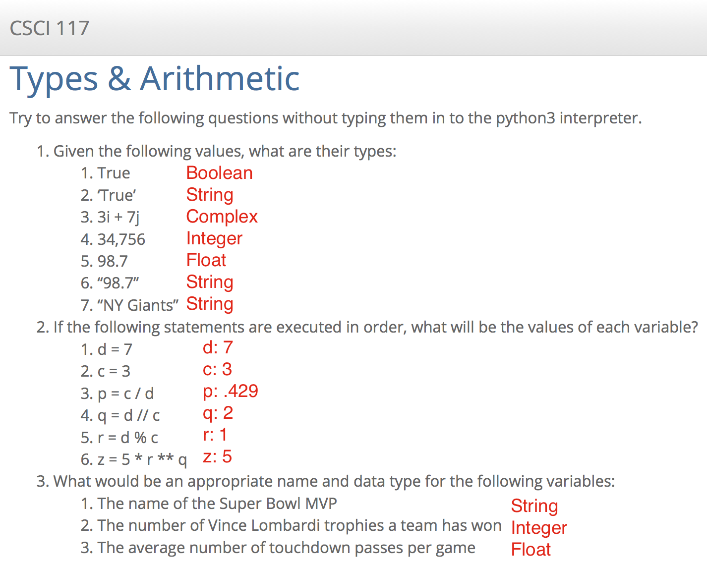

# Practice HW3: Python Syntax & Variables

## A simple python program

1. Create a folder `hw3_uLogin` where you replace `uLogin` with your Drew e-mail address before the @ sign.
2. Go into this folder by typing `cd hw3_uLogin` and create a python file: `touch hello_variable.py`
3. Edit the file (`ped hello_variable.py`):
    4. Create a variable to store your first name
    1. Print "Hello, my name is ..." and replace the ellipsis (...) with the variable that is storing your first name.
    1. Add a comment at the top of the file that explains what your program does.
4. Copy your python file `hello_variable.py` to `hello_me.py`.
4. Run your python program: `python3 hello_me.py`
5. Create a second program called `tips.py`, that:
    1. Has 4 variables:
        * meal: holds the value of the meal ($53.48)
        * tax: holds the tax percentage (7%)
        * tip: holds the tip percentage (18%)
        * total: holds the total of the meal. Proper tipping technique dictates that the tip should be calculated based on the total cost of the meal, before tax is applied.
    1. Prints the contents of the total variable with a leading dollar sign ($).
4. Run your python program: `python3 tips.py`. The total should be `$66.85`
5. Once you're satisfied that your programs are working correctly, zip it for submission:
    - `cd ..`
    - `zip hw3_uLogin.zip hw3_uLogin/*`

## Types & Arithmetic

Try to answer the following questions without typing them in to the python3 interpreter.

1. Given the following values, what are their types:
    1. True
    1. 'True'
    1. 3 + 7j
    1. 34,756
    1. 98.7
    1. "98.7"
    1. "NY Giants"
2. If the following statements are executed in order, what will be the values of each variable?
    1. d = 7
    1. c = 3
    1. p = c / d
    1. q = d // c
    1. r = d % c
    1. z = 5 * r ** q
3. What would be an appropriate name and data type for the following variables:
    1. The name of the Super Bowl MVP
    1. The number of Vince Lombardi trophies a team has won
    1. The average number of touchdown passes per game



<!-- Allow 45 minutes for all? -->

## Demonstration

Once you've finished doing the HW a single time, you can watch me do it:





### Solutions to Questions

