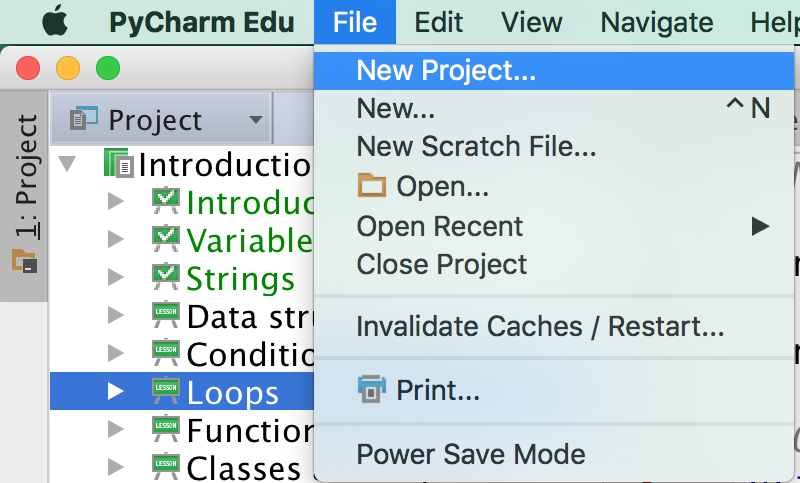
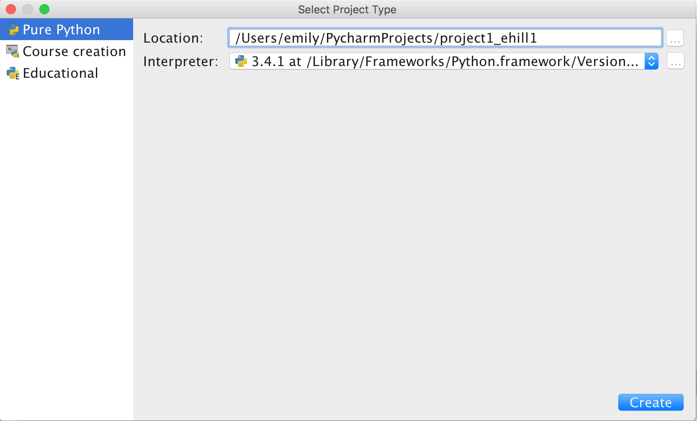
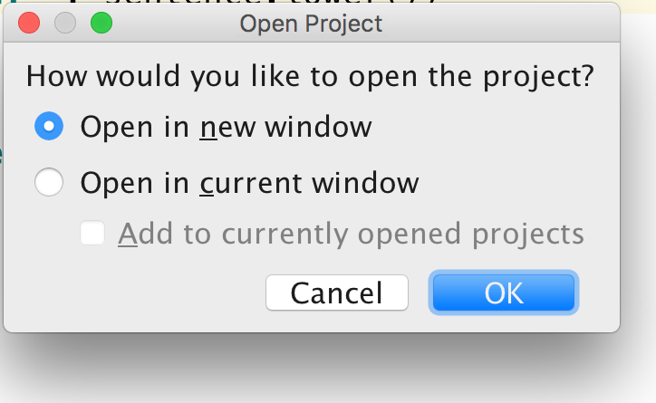
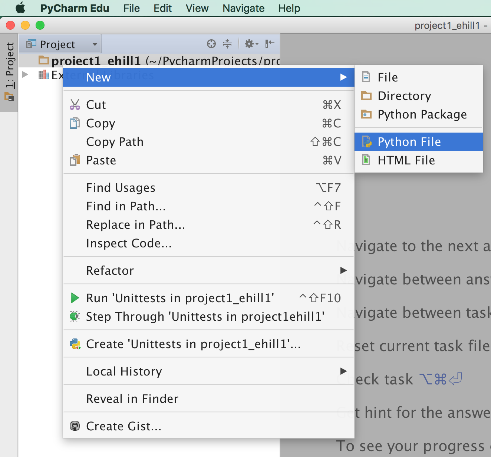
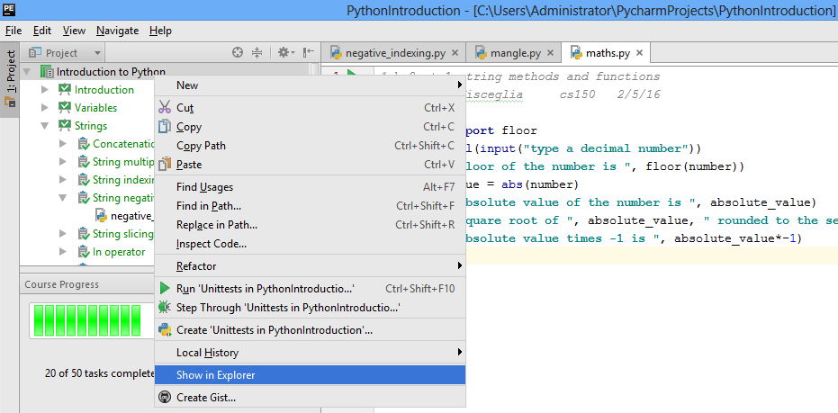
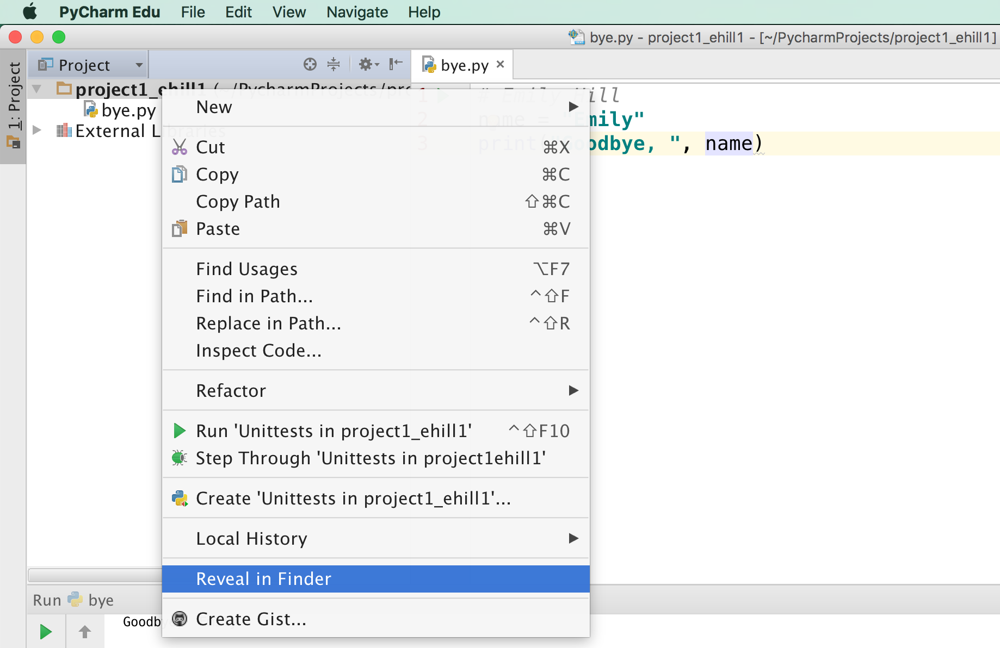
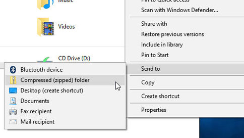
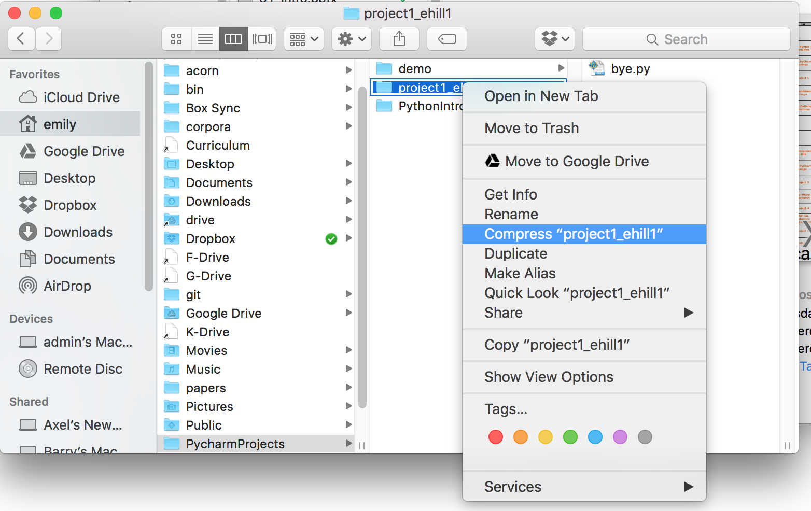

# Project 1: Using Strings & Functions
<!--
-->

## Setup

1. In PyCharm, create a new project with the name `project1_uLogin`, where you replace "`uLogin`" with the beginning of your Drew e-mail address before the `@` symbol:
    * Go to `File > New Project`: 
    * Name the project: 
    * I recommend opening the project in a new window for now: 
2. Create 5 python files: `bye.py`, `convert.py`, `fun.py`, `string.py`, and `madlibs.py`. To create a file, right-click on the project and select `New > Python File`:  

<!--  * `mkdir project1_uLogin1_uLogin2`
  * `cd project1_uLogin1_uLogin2`
  * `touch bye.py convert.py fun.py string.py`-->

***Don't forget to add a comment at the top of each program with your name and what the program does.***

## bye.py

3. Edit the file `bye.py`:
    4. Create a variable that stores a name    
    1. Print "Goodbye, ...!" and replace the ellipsis (...) with the variable that is storing your last name.
    1. Add a comment at the top of the file that explains what your program does and who the authors are.
4. Run your python program to make sure the output is correct

## convert.py

Create a program `convert.py`, that takes a temperature in degrees Fahrenheit as input and outputs the equivalent temperature in degrees Celsius. Your program should have 2 variables:

  * `degrees_f`: holds a temperature in degrees fahrenheit (input from the user)
  * `degrees_c`: holds the temperature in degrees celsius. To convert fahrenheit to celsius, deduct 32 from the fahrenheit temperature and multiply by 5/9.

Your program should print the values of both variables with a string description, such as: `"F degrees fahrenheit = C degrees celsius"`, replacing F & C with the values of your variables.

For example:

| **degrees_f** | **degrees_c** | **output** |
|:---:|:---:|:---:|
| 86 | 30 | 86 degrees fahrenheit = 30 degrees celsius |
| 72 | 22 | 72 degrees fahrenheit = 22 degrees celsius |
| 32 | 0 | 32 degrees fahrenheit = 0 degrees celsius |

<!--## convert.py

Create a program `convert.py`, that takes a measurement in inches as input and outputs the equivalent length in centimeters. Your program should have 2 variables:

  * `inches`: holds the length in inches (input from the user)
  * `cm`: holds the length in centimeters. To convert inches to cm, multiply by 2.54.

Your program shold print the values of both variables with a string description, such as: `"I inches = C cm"`, replacing I & C with the values of your variables.

For example:

| **inches** | **cm** | **output** |
|:---:|:---:|:---:|
| 1 | 2.54 | 1 inches = 2.54 cm |
| 12 | 30.48 | 12 inches = 30.48 cm |
| 39.5 | 100.33 | 39.5 inches = 100.33 cm |-->

## fun.py

Write a program `fun.py` that takes a float as input from the user and prints out the following information using the math module:

  1. The ceiling of the number (e.g., `ceiling(3.75)` is 4)
  1. The number rounded to 0 decimal places
  1. The rounded number's absolute value
  1. The factorial of the rounded number's absolute value

Think about how you can apply the concept of DRY coding (Don't Repeat Yourself) to make your solution more concise.

## string.py

Write a program `string.py` that takes a string as input from the user and:

  * Prints the string after performing the following two mangle operations:
      1. Swaps upper and lower case letters
      1. Removes the second and second to last characters
  * Prints only the middle 3 letters of the string using the substring or splice operation (`[:]`)
  
For example:

| **string** | **Mangled Output** | **Middle 3** |
|:---:|:---:|:---:|
| Monty Python!! | mNTY pYTHON! | 'Pyt' |
| hello | HLO | ell |
| oh! | OH! | oh! |

<!--| **string** | **Mangled Output** | **Middle 3** |
|:---:|:---:|:---:|
| Monty Python | mOTY pYTON | 'y P' |
| hello! | HEO! | 'ell' or 'llo' |
| oh | OH | '' |-->

## madlibs.py

Create a program `madlibs.py` that takes at least 6 parts of speech from the user as input, and outputs a story using those words. Your program should include ***at least*** one of each of the following parts of speech:

  * Noun
  * Adjective
  * Verb
  * Verb past tense
  * Proper Name or Place or Animal
  
Each submission should be unique. You should not depend on any external files or modules (i.e., no imports); your program should be self-contained. If you choose to make use of any online resources, please include the URL in your comments and a brief description of how you used the resource to guide your implementation.

## Submission

Once you're satisfied that your programs are working correctly, zip it for submission:

  - Locate your project on your computer's hard drive. PyCharm can help:
      * **on windows:** 
      * **on mac:** 
  - Right-click on your project folder & create a zip file
    * **on windows:** 
    * **on mac:** 
  - Make sure to name your zip file `project1_uLogin1.zip`

Upload your zip file to Canvas.

## Hints
  * Gave your project or file the wrong name? Right-click on it & go to `Refactor > Rename`