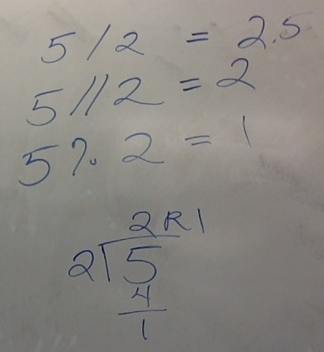

<!--morea_url: /morea/02.OO-intro/board_notes.JPG-->

# Board & Demo Notes 2/6 & 2/9

## Python arithmetic 2/6

Python supports 6 basic arithmetic operations:

 * addition (+)
 * subtraction (-)
 * multiplication (*)
 * floating point division (/)
 * integer division (//) -- rounds down to nearest whole number
 * exponent (**)
 * remainder or modulus (%) -- returns remainder after division

Below are some examples we looked at in class: 
 

## Python arithmetic 2/9

Below are some examples we looked at in class: 
 

Regarding order of operations & precedence: 
 

## Example program(s) from 2/9

 * [arith_and_assign.py](arith_and_assign.py)
 * [input_demo.py](input_demo.py)
 