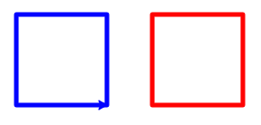
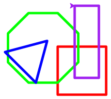
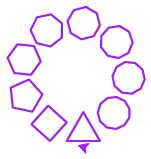
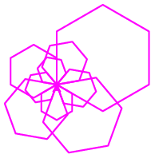
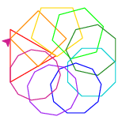
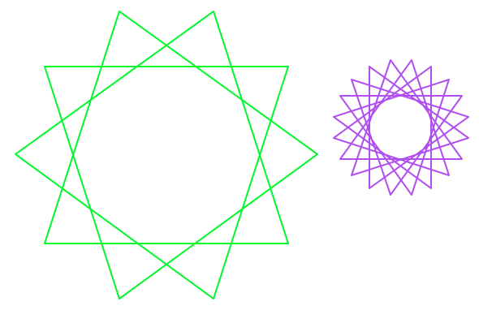
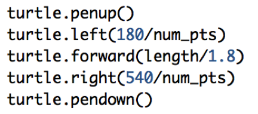
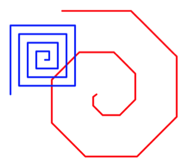
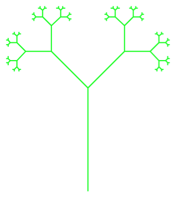
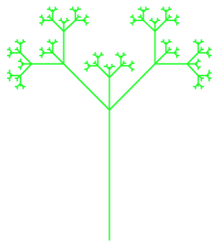

# Project 2: Turtle Drawing

*In the beginning of the semester we drew interesting shapes on code.org. In this project, we will use python's [turtle module](https://docs.python.org/3.4/library/turtle.html) to draw shapes both iteratively and recursively. In this project, we will use loops, functions, conditions, and variables to draw pictures with the python turtle package.*

<!--***You must work with a partner (unless granted permission in advance)**; make sure both students are clearly identified in the comments at the top of each program.*-->

An important skill as a computer scientist is the ability to learn how to use an existing API library by reading documentation, finding good API usage examples on the internet, and adapting those examples to meet your needs. In this project, you will begin building these skills to help you make the transition from classroom to practice.

To complete the assignment, you will need:

  * Detailed project description (this page)
  * [Python turtle documentation](https://docs.python.org/3.4/library/turtle.html#overview-of-available-turtle-and-screen-methods)
  * Create a new project in PyCharm with the name `project2_uLogin`, where you replace "`uLogin`" with the beginning of your Drew e-mail address before the `@` symbol

If you get stuck, please e-mail me a zip file of your project, a screenshot, and a description of:

  1. What you expect to happen
  1. What is actually happening
  
The assignment is broken down into checkpoints. The final submission must include the zip file of all the code, but the prior check points can simply be screenshots.

# Instructions

<!--Create a folder `project2-uLogin1_uLogin2`, replacing the uLogins with the e-mail ids of you and your partner. 
-->
## Part 1: Learn how to work with turtles

### 1. Draw a line

Create a python program where you can play with turtles. Draw a line on the screen using the python turtle package. I learned how to make turtle programs by using [these examples](http://openbookproject.net/thinkcs/python/english3e/hello_little_turtles.html).

A basic turtle program looks like the following:

	import turtle
	turtle.shape("turtle")  # optional
	turtle.speed(0)         # optional
	
	turtle.forward(90)
	turtle.left(90)
	turtle.forward(90)

	turtle.Screen().exitonclick()

The first & last lines should be in ***every*** turtle program you write. ***DO NOT NAME YOUR PROGRAM turtle.py!***

### 2. Draw a square

1. Draw a square on the screen. 

2. Change its color. 

3. Make the line thicker by changing the pensize or width. 

4. Change the speed the turtle draws.

5. Make a `square` function that takes the length of each side as a parameter & draws a square using the `turtle`. Call this function instead of the lines you used to draw the square in step 1 above.

### 3. Draw two squares

It’s possible to move the turtle without drawing. Draw two squares on the screen that don’t touch. For example:



Now you’re ready to tackle the rest of the assignment. To speed up testing, set the turtle speed to be 0. 


### Submitting Part 1

Once you're satisfied that your program is working correctly, take a screen shot of your two squares code and the two squares display and submit it to Google classroom.

## Part 2: Functions

***None of the following turtle programs should take user input!***

### shapes.py

Create a program `shapes.py` that implements the following functions. You may find [this webpage](http://www.mathsisfun.com/geometry/interior-angles-polygons.html) to be helpful.

1.	`rectangle(width, height)`: takes the length of the width and height as parameters.
1.	`square(side)`: takes the length of a side as a parameter. **Implement this by calling the `rectangle` function**.
1.	`triangle(side)`: takes the length of a side as a parameter and draws an equilateral triangle.
1.	`decagon(side)`: takes the length of a side as a parameter and draws a decagon.

<!--1.	`octagon(side)`: takes the length of a side as a parameter and draws an octagon.
1.	`hexagon(side)`: takes the length of a side as a parameter and draws an hexagon.
1.	`pentagon(side)`: takes the length of a side as a parameter and draws an pentagon.
-->

Test that your functions work by clearly drawing a square, rectangle, triangle, and decagon on the screen. They shouldn’t overlap too much. For example:


 
***Every submitted picture should look unique for the whole project.***

Remember to declare all your functions at the ***top*** of the file, ***before*** you call them.

### polygon.py

Next we’ll generalize our polygon drawing by writing a program `polygon.py` with the following function:

`polygon(num_sides, length)`: takes the number of sides (`num_sides`) and the length of each side (`length`) as parameters. If the number of sides is less than 3, draw nothing.

***Hint***: To determine how far to turn your turtle, you will  need to [divide 360 (the number of degrees in a circle) by the number of sides](http://www.mathsisfun.com/geometry/interior-angles-polygons.html).

Test that your function works by using a loop to draw a number of shapes in an interesting pattern. Here are some examples:

  

***Every submitted picture should look unique.***

### star_polygon.py

We can use a similar technique to draw stars with an arbitrary number of points, called [regular star polygons](https://en.wikipedia.org/wiki/Regular_polygon#Regular_star_polygons). Write a program `star_polygon.py` with the following function:

`star_polygon(num_pts, num_skip, side_length)`: takes the number of points (`num_pts`), the number of points to skip to calculate the next angle (`num_skip`)  and the length of each line in the star (`side_length`) as parameters.

***Hint***: You can calculate the angle to turn your turtle by multiplying 360 by the number of points to skip, divided by the total number of points.


<!--You will need a different approach to drawing the stars depending on if there is an odd or even number of points.-->

<!--***Hints***:

- Implement the odd case first.  
- How far should your turtle turn for an odd-pointed star? Twice as much as you did for the polygon version. -->


Here are some examples:


***Every submitted picture should look unique.***

<!--Even-sided stars can be drawn as two separate polygons with half the number of points. For example, a six-sided star can be drawn as two triangles. In between drawing these two polygons, you may find it useful to move your turtle:


 
Test that your function works by drawing at least an even- and odd-pointed star. You should have ***one*** function called `polygram` that is capable of drawing ***both*** even- & odd-pointed stars. However, feel free to delegate the responsibility of drawing odd- and even-pointed stars by writing separate functions ***called*** by `polygram`.-->

### Submitting Part 2

Once you're satisfied that your programs are working correctly, take a screen shot of each program and the display when it's run and submit it to Google classroom.

## Part 3: Recursion

### spiral.py

Let’s explore recursion by writing a program `spiral.py` with the following functions:

`spiral(length, angle)`: takes the length of the spiral (`length`) and the angle of the spiral (`angle`) as parameters. **Implement using recursion.** Think about how the parameters change at each recursive step. Should either parameter stay the same? What’s the base case?

`spiral_loop(length, angle)`: takes the length of the spiral (`length`) and the angle of the spiral (`angle`) as parameters. **Implement using iteration.** How should the loop change at each step/iteration?



***Every submitted picture should look unique.***

Test your functions by drawing two different spirals.

### tree.py

Create a program `tree.py` that recursively draws a tree using the following function:

	def tree(size, angle):
		if size > 2:
			turtle.forward(size)
			turtle.right(angle)
			tree(size/2, angle)    # call A
			turtle.left(2*angle)
			tree(size/2, angle)    # call B
			turtle.right(angle)
			turtle.back(size)
	
	turtle.left(90)
	tree(200, 45)

Modify the above function so the output changes from this:

 to this:   

### fibonacci.py

Our final recursive program does not make use of turtle. Instead, it will use recursion to calculate the *nth* [fibonacci number](http://www.mathsisfun.com/numbers/fibonacci-sequence.html). A fibonacci number is calculated by adding the two numbers that come before it in the sequence. Think about what the recursive step will look like. Assume the sequence starts at 0 (for n = 0). How many base cases are need?

Write a program `fibonacci.py` with the following functions:

`fibonacci(n)`: takes the fibonacci sequence number (`n`) as a parameter and returns the sum of the previous two terms in the sequence. This should be implemented recursively.

`fibonacci_list(n)`: takes the fibonacci sequence number (`n`) as a parameter and returns the sum of the previous two terms in the sequence. This should be implemented iteratively using a list.

Test that your functions work by getting a number (`n`) **as input from the user** and printing the result of calling your fibonacci function. **Note:** this is the ***only*** program in this project that should take user input.


## Grading

You will be graded on the following:

- **Correctness**: Your code should perform as specified. Correctness will count for the largest portion of your grade.
- **Docstrings**: For each function that you design from scratch, write a good docstring (`"""`). 
- **Internal comments**: Within functions, the more complicated parts of your code should also be described using "internal" comments (i.e., docstrings).
- **Programming style**: Your variable names should be meaningful and your code as simple and clear as possible.
- **Formatting style**: Each line should be less than 80 characters long including spaces. You should break up long lines using `\`. 

## Submitting

When complete, your project should include the following six python programs:

- `shapes.py`
- `polygon.py`
- `star_polygon.py`
- `spiral.py`
- `tree.py`
- `fibonacci.py`

Zip your project using the same steps as for the earlier project, giving the zip file the same name as your `project2_uLogin` folder name, and submit to google classroom.
