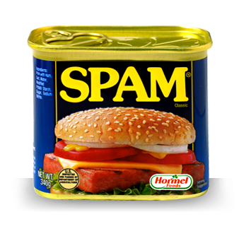
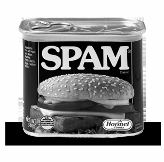
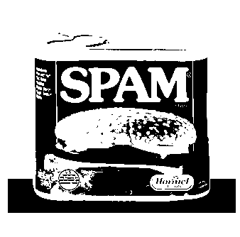
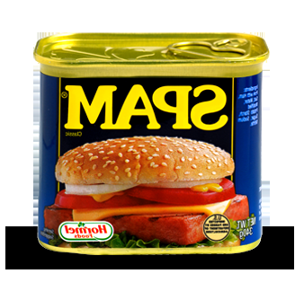
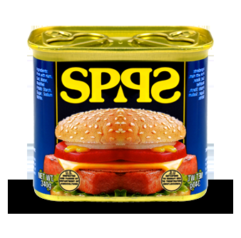

# Project 3: Image Manipulation

In this project you will have the opportunity to programmatically manipulate png image files with python.

First, download [project3.zip](project3.zip) and unzip it. You should see the following files:

  * **Test images**: `arch.png`, `hmcOlinSmall.png`, `in.png`, `out.png`, `spam.png`, `trees.png`
  * Programs:
     * `image_fun.py`: where you will write your project code
     * `png.py`: library to work with png files **DO NOT MODIFY**
     * `png_helper.py`: helper functions to manipulate png files **DO NOT MODIFY**
     
**Rename the folder** so that it is `project2_uLogin` rather than just `project2`. If you are working with a partner, make sure both uLogins are listed.

Next, try running the code: `python image_fun.py`. **Make sure to run with python, NOT python3.** If successful, when you `ls` you should see a new file, `out2.png`. Open `out2.png` and `out.png` to make sure they look the same.

## Understanding `invert`

Read over the `invert` function in `image_fun.py` to see how it works. At the bottom of the file, change the call to invert to use the `in.png` image: . Once inverted, it should look like: . Similarly:

 

The `invert` function modifies an image to create its negative. That is, all color values are 255 minus their original value. Especially note the use of list comprehension in `invert`, which iterates over every pixel in the image and calls `change(rgb values)`. It's easiest to also write greyscale and binarize in the same format: a main function that accepts user input and contains a list comprehension that calls a helper function, `change`, on each pixel. 

## Playing with Pixels

### grayscale

Write a function called `grayscale` that modifies an image to make it grayscale. For this, you'll want to do something similar to `invert`, except that your new change function will calculate the [luminance](http://en.wikipedia.org/wiki/Luminance_(relative)) of the pixel. For example:

 

<!--As Wikipedia calculates it, luminance is 21% red, 72% green, and 7% blue. Intuitively, this makes sense because if you think of standard red, green, and blue, green is the lightest and thus has highest positive impact luminance, while blue is darker and has a lower value for luminance. -->

Since luminance is an indication of how white/black a pixel is, having your helper function return a list of RGB values in greyscale is easy -- just return the same value in each of the three color channels! How much gray? You can use the following equation for luminance:

    Gray = 0.2126 * Red + 0.7152 * Green + 0.0722 * Blue

***Hints:***

* Getting an **OverflowError: unsigned byte integer is greater than maximum**? This might be because your luminance calculation results in RGB values higher than 255. Make sure that all of your percentages add up to 1.
* Getting a **filename is not defined** error? Make sure you have single quotes around the image name when you call it in Python shell, the image is in the same folder as your python script, and permissions on your image are correct. 

### binarize

Write a function called `binarize`, which binarizes an image (makes it black and white) with a threshold `thresh` given by the user as a parameter. This threshold is a brightness value between 0 and 255 - if a pixel is greater than the threshold value, then it should turn white, and if its less than the threshold value, then it should turn black. So, a threshold value of 0 means that your photo will turn white and a threshold of 255 means your photo will turn black. For example:

 

## Geometric Transformations

### flipVert

Write a function called `flipVert`, which flips the image on its horizontal axis (the bottom is on the top and the top is on the bottom). For example:

 

You will use the same basic structure as the earlier problems--one main function that opens the file and calls the helper function in a list comprehension.

***Hints:***

* In `flipVert`, you'll want to iterate over only the rows instead of the pixels in `Im_pix` and reverse their order. 
* If `L` is a list, then `L[::-1]` is the reverse of that list. 

### flipHoriz

Write a function `flipHoriz` that flips the image on its vertical axis. This should work in the same way as `flipVert` but flip in the horizontal direction. For example:

<!----> 

Instead of reordering the rows, you want to consider how the pixels in the rows reorder when an image is flipped horizontally. Note: flipping `in.png` horizontally has no effect because it is symmetric about the vertical axis.

### mirrorVert

Write a function `mirrorVert` that mirrors the image across its horizontal axis (i.e., so that the top part is mirrored upside down on the bottom of the image). The easiest approach is to replace the bottom half of `Im_pix` with the reversed rows from the top half. To do this, you'll use the built-in function `getWH()` in `png_helper.py` to get the height of `Im_pix`. For example:

 

Warning: You cannot create a copy of a list with `list1 = list2`, because instead of creating a new object, Python will just create a new reference to the old list. However, list slicing does create new copies of data, so consider how you could combine two slices, each of half the size of the original list, in order to mirror the image...

### mirrorHoriz

Write a function `mirrorHoriz` that mirrors the image across its vertical axis. This should work similar to `mirrorVert`, but instead of replacing the bottom rows with the reversed top rows (as you did in `mirrorVert`), you'll replace the last half of the pixels in every row with the reversed first half of the pixels. For example:

<!----> 

*(The bigger question: which side of the SPAM can do you open?)*

### scale

Write a function `scale that` scales the image to half of each of its original dimensions (this will be a quarter of its original area). The easiest way to do this is to eliminate every other pixel in each row (scaling the image horizontally) **and** eliminate every other row (scaling the image vertically). 

## Extra Credit

Make your own transformations! Make sure to comment.

## Submission

Make sure your `image_fun.py` file contains 7 additional functions: `grayscale`, `binarize`, `flipVert`, `flipHorz`, `mirrorVert`, `mirrorHoriz`, and `scale`. Be sure to test them all at the bottom of the file. Make sure you've added your name to the comments at the top of the file, that your program contains comments and follows good programming style.

Once you’re satisfied that your programs are working correctly, zip it for submission:

  * `cd ..`
  * `zip project3_uLogin.zip project3_uLogin/*`


*Assignment adapted from [Harvey Mudd's CS 5 Fun with Images](https://www.cs.hmc.edu/twiki/bin/view/CS5/FunWithImagesGold2010).*