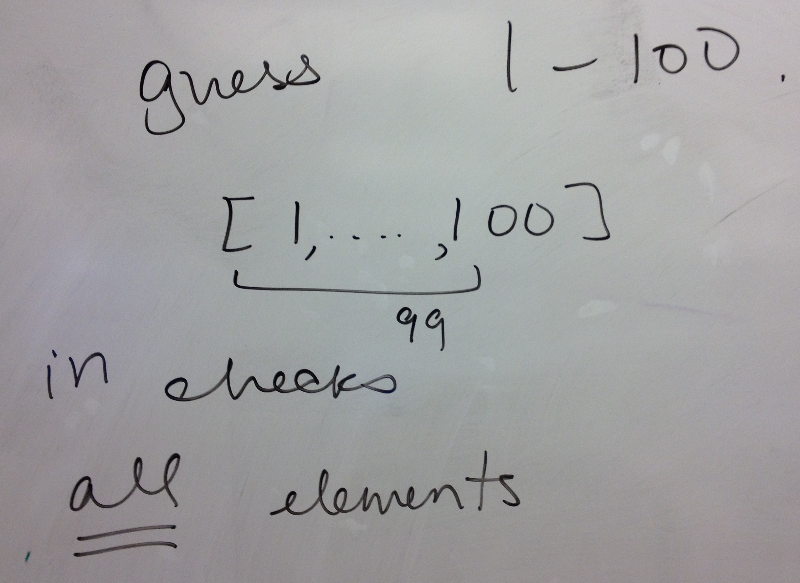
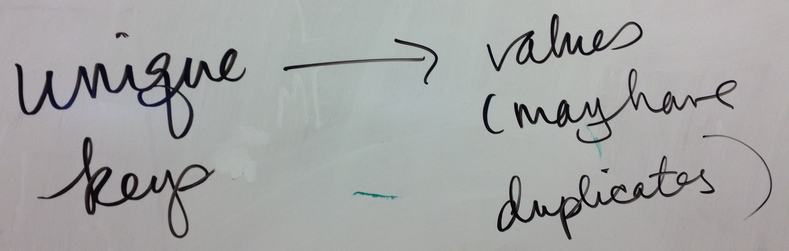
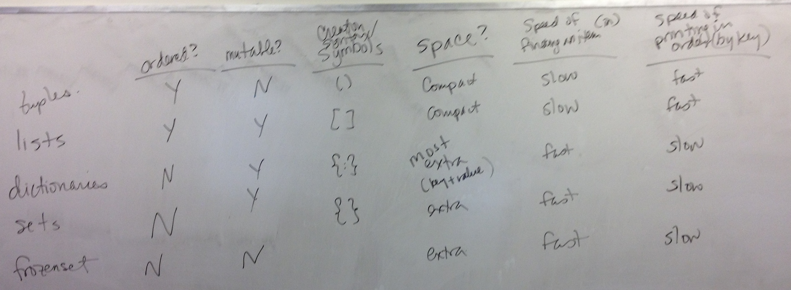
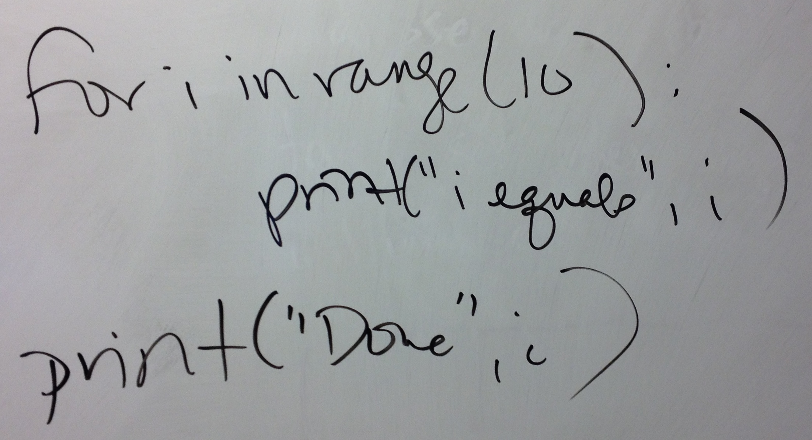

# Board & Demo Notes

## Examples from 3/30

 * [ascii_dictionary.py](ascii_dictionary.py)
 * [using_dictionary.py](using_dictionary.py)

How mant items in a list do you need to check when using `in`?

A dictionary maps keys to values:

Differences between python data structures: tuples, lists, dictionaries, sets

Equivalen for loop to a list comprehension:

## Examples from 4/1

 * [while.py](while.py)
 * [whilevsfor.py](whilevsfor.py) 
 * [while_practice.py](while_practice.py) -- wrote in class
 * [loop.py](loop.py)
 * [scope.py](scope.py)
 * [data.zip](data.zip) (for the file examples below)
 * [file_read.py](file_read.py)
 * [file_read2.py](file_read2.py)
 * [file_read_while.py](file_read_while.py)
 * [file_write.py](file_write.py)
 * [avgData.py](avgData.py)
 * [years_dictionary.py](years_dictionary.py)
 * [years_dictionary2.py](years_dictionary2.py)
 * [writeSumReport.py](writeSumReport.py)

## Console Notes 4/1

	admins-MacBook-Pro-3:09.dict emily$ python3 while_practice.py 
	1
	2
	3
	4
	5
	admins-MacBook-Pro-3:09.dict emily$ python3 while_practice.py 
	1
	2
	3
	4
	5
	2
	5
	8
	11
	admins-MacBook-Pro-3:09.dict emily$ python3 while_practice.py 
	A:
	1
	2
	3
	4
	5
	
	B:
	2
	5
	8
	11
	admins-MacBook-Pro-3:09.dict emily$ python3 while_practice.py 
	A:
	1
	2
	3
	4
	5
	
	B:
	2
	5
	8
	11
	
	C:
	****
	****
	****
	admins-MacBook-Pro-3:09.dict emily$ ls
	ascii_dictionary.py  reading-TP.md
	avgData.py           reading-TP2.md
	board.md             reading-TP3.md
	ca.md                scope.py
	data                 slides.md
	data.zip             slides2.md
	file_read.py         using_dictionary.py
	file_read2.py        while.py
	file_read_while.py   while_practice.py
	file_write.py        whilevsfor.py
	loop.py              writeSumReport.py
	module.md            years_dictionary.py
	reading-CS5.md       years_dictionary2.py
	admins-MacBook-Pro-3:09.dict emily$ ls data
	alaska.dat       majors.dat       songs.txt
	famous_pairs.txt movies.txt       virginia.dat
	florida.dat      nodata.dat       years.dat
	grammy_noms.txt  oscars.txt       years2.dat
	majors.all.dat   report.dat
	admins-MacBook-Pro-3:09.dict emily$ cat data/songs.txt 
	Adele's Rolling In The Deep
	Taylor Swift's Mean
	Foster the People's Pumped Up Kicks
	Maroon 5 & Christina Aguilera's Moves Like Jagger
	Bruno Mars' Doo-Wops & Hooligans
	Katy Perry's Firework
	Lady Gaga's Born This Way
	Adele's Someone Like You
	admins-MacBook-Pro-3:09.dict emily$ python3
	Python 3.4.1 (v3.4.1:c0e311e010fc, May 18 2014, 00:54:21) 
	[GCC 4.2.1 (Apple Inc. build 5666) (dot 3)] on darwin
	Type "help", "copyright", "credits" or "license" for more information.
	>>> dataFile = open("data/songs.txt", "r")
	>>> data = dataFile.read()
	>>> print(data)
	Adele's Rolling In The Deep
	Taylor Swift's Mean
	Foster the People's Pumped Up Kicks
	Maroon 5 & Christina Aguilera's Moves Like Jagger
	Bruno Mars' Doo-Wops & Hooligans
	Katy Perry's Firework
	Lady Gaga's Born This Way
	Adele's Someone Like You
	
	>>> data.upper()
	"ADELE'S ROLLING IN THE DEEP\nTAYLOR SWIFT'S MEAN\nFOSTER THE PEOPLE'S PUMPED UP KICKS\nMAROON 5 & CHRISTINA AGUILERA'S MOVES LIKE JAGGER\nBRUNO MARS' DOO-WOPS & HOOLIGANS\nKATY PERRY'S FIREWORK\nLADY GAGA'S BORN THIS WAY\nADELE'S SOMEONE LIKE YOU\n"
	>>> dataFile.close()
	>>> dataFile = open("data/songs.txt")
	>>> data = dataFile.read()
	>>> print(data)
	Adele's Rolling In The Deep
	Taylor Swift's Mean
	Foster the People's Pumped Up Kicks
	Maroon 5 & Christina Aguilera's Moves Like Jagger
	Bruno Mars' Doo-Wops & Hooligans
	Katy Perry's Firework
	Lady Gaga's Born This Way
	Adele's Someone Like You
	
	>>> dataFile.write("Flick of that Wrist\n")
	Traceback (most recent call last):
	  File "<stdin>", line 1, in <module>
	io.UnsupportedOperation: not writable
	>>> dataFile.close()
	>>> dataFile = open("data/songs.txt", "a")
	>>> dataFile.write("Flick of that Wrist\n")
	20
	>>> dataFile.read()
	Traceback (most recent call last):
	  File "<stdin>", line 1, in <module>
	io.UnsupportedOperation: not readable
	>>> exit()
	admins-MacBook-Pro-3:09.dict emily$ cat data/songs.txt 
	Adele's Rolling In The Deep
	Taylor Swift's Mean
	Foster the People's Pumped Up Kicks
	Maroon 5 & Christina Aguilera's Moves Like Jagger
	Bruno Mars' Doo-Wops & Hooligans
	Katy Perry's Firework
	Lady Gaga's Born This Way
	Adele's Someone Like You
	Flick of that Wrist
	admins-MacBook-Pro-3:09.dict emily$ cp data/songs.txt data/songs2.txt 
	admins-MacBook-Pro-3:09.dict emily$ python3
	Python 3.4.1 (v3.4.1:c0e311e010fc, May 18 2014, 00:54:21) 
	[GCC 4.2.1 (Apple Inc. build 5666) (dot 3)] on darwin
	Type "help", "copyright", "credits" or "license" for more information.
	>>> dataFile = open("data/songs2.txt", "w")
	>>> dataFile.write("Sgt. Pepper's Lonely Hearts Club Band")
	37
	>>> exit
	Use exit() or Ctrl-D (i.e. EOF) to exit
	>>> exit()
	admins-MacBook-Pro-3:09.dict emily$ cat data/songs2.txt 
	Sgt. Pepper's Lonely Hearts Club Bandadmins-MacBook-Pro-3:09.dict emily$ cat data/songs.txt 
	Adele's Rolling In The Deep
	Taylor Swift's Mean
	Foster the People's Pumped Up Kicks
	Maroon 5 & Christina Aguilera's Moves Like Jagger
	Bruno Mars' Doo-Wops & Hooligans
	Katy Perry's Firework
	Lady Gaga's Born This Way
	Adele's Someone Like You
	Flick of that Wrist
	admins-MacBook-Pro-3:09.dict emily$ python3
	Python 3.4.1 (v3.4.1:c0e311e010fc, May 18 2014, 00:54:21) 
	[GCC 4.2.1 (Apple Inc. build 5666) (dot 3)] on darwin
	Type "help", "copyright", "credits" or "license" for more information.
	>>> dataFile = open("data/songs2.txt", "r")
	>>> type(dataFile)
	<class '_io.TextIOWrapper'>
	>>> print(dataFile)
	<_io.TextIOWrapper name='data/songs2.txt' mode='r' encoding='UTF-8'>
	>>> exit
	Use exit() or Ctrl-D (i.e. EOF) to exit
	>>> exit()
	admins-MacBook-Pro-3:09.dict emily$ ls
	ascii_dictionary.py  reading-TP.md
	avgData.py           reading-TP2.md
	board.md             reading-TP3.md
	ca.md                scope.py
	data                 slides.md
	data.zip             slides2.md
	file_read.py         using_dictionary.py
	file_read2.py        while.py
	file_read_while.py   while_practice.py
	file_write.py        whilevsfor.py
	loop.py              writeSumReport.py
	module.md            years_dictionary.py
	reading-CS5.md       years_dictionary2.py
	admins-MacBook-Pro-3:09.dict emily$ ped file_read*
	admins-MacBook-Pro-3:09.dict emily$ open board.md 
	admins-MacBook-Pro-3:09.dict emily$ ll -rt
	total 224
	-rw-r--r--   1 emily  staff   933B Mar 30 10:02 years_dictionary2.py
	-rw-r--r--   1 emily  staff   1.0K Mar 30 10:02 years_dictionary.py
	-rw-r--r--   1 emily  staff   1.2K Mar 30 10:02 using_dictionary.py
	-rw-r--r--   1 emily  staff   218B Mar 30 10:02 slides.md
	-rw-r--r--   1 emily  staff   371B Mar 30 10:02 reading-TP3.md
	-rw-r--r--   1 emily  staff   488B Mar 30 10:02 reading-TP2.md
	-rw-r--r--   1 emily  staff   379B Mar 30 10:02 reading-TP.md
	-rw-r--r--   1 emily  staff   475B Mar 30 10:02 reading-CS5.md
	-rw-r--r--   1 emily  staff   650B Mar 30 10:02 ca.md
	-rw-r--r--   1 emily  staff   468B Mar 30 10:02 ascii_dictionary.py
	-rw-r--r--   1 emily  staff   1.7K Apr  1 10:59 writeSumReport.py
	-rw-r--r--   1 emily  staff   182B Apr  1 10:59 whilevsfor.py
	-rw-r--r--   1 emily  staff    72B Apr  1 10:59 while.py
	-rw-r--r--   1 emily  staff   224B Apr  1 10:59 slides2.md
	-rw-r--r--   1 emily  staff    91B Apr  1 10:59 scope.py
	-rw-r--r--   1 emily  staff   434B Apr  1 10:59 module.md
	-rw-r--r--   1 emily  staff    53B Apr  1 10:59 loop.py
	-rw-r--r--   1 emily  staff   575B Apr  1 10:59 file_write.py
	-rw-r--r--   1 emily  staff   195B Apr  1 10:59 file_read_while.py
	-rw-r--r--   1 emily  staff   554B Apr  1 10:59 file_read2.py
	-rw-r--r--   1 emily  staff   471B Apr  1 10:59 file_read.py
	-rw-r--r--   1 emily  staff    13K Apr  1 10:59 data.zip
	-rwxr-xr-x   1 emily  staff   1.2K Apr  1 10:59 board.md
	-rw-r--r--   1 emily  staff   1.1K Apr  1 10:59 avgData.py
	-rw-r--r--@  1 emily  staff   249B Apr  1 11:34 while_practice.py
	drwxr-xr-x  17 emily  staff   578B Apr  1 11:46 data
	admins-MacBook-Pro-3:09.dict emily$ 