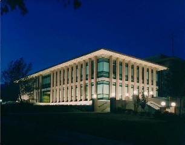
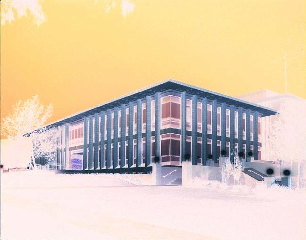

# Project 2: Image Manipulation

In this project you will have the opportunity to programmatically manipulate png image files with python.

First, download [project2.zip](project2.zip) and unzip it. You should see the following files:

  * **Test images**: `arch.png`, `hmcOlinSmall.png`, `in.png`, `out.png`, `spam.png`, `trees.png`
  * Programs:
     * `image_fun.py`: where you will write your project code
     * `png.py`: library to work with png files **DO NOT MODIFY**
     * `png_helper.py`: helper functions to manipulate png files **DO NOT MODIFY**

Next, try running the code: `python image_fun.py`. **Make sure to run with python, NOT python3.** If successful, when you `ls` you should see a new file, `out2.png`. Open `out2.png` and `out.png` to make sure they look the same.

## Understanding `invert`

Read over the `invert` function in `image_fun.py` to see how it works. At the bottom of the file, change the call to invert to use the `in.png` image: . Once inverted, it should look like: . Similarly:

 

The `invert` function modifies an image to create its negative. That is, all color values are 255 minus their original value. Especially note the use of list comprehension in `invert`, which iterates over every pixel in the image and calls `change(rgb values)`. It's easiest to also write greyscale and binarize in the same format: a main function that accepts user input and contains a list comprehension that calls a helper function on each pixel. 

## Playing with Pixels

### grayscale

write a function called `grayscale` that modifies an image to make it grayscale. For this, you'll want to do something similar to `invert`, except that your new change function will calculate the [luminance](http://en.wikipedia.org/wiki/Luminance_(relative)) of the pixel. 

<!--As Wikipedia calculates it, luminance is 21% red, 72% green, and 7% blue. Intuitively, this makes sense because if you think of standard red, green, and blue, green is the lightest and thus has highest positive impact luminance, while blue is darker and has a lower value for luminance. -->

Since luminance is an indication of how white/black a pixel is, having your helper function return a list of RGB values in greyscale is easy -- just return the same value in each of the three color channels! 

## Geometric Transformations

----

*Adapted from [Harvey Mudd's CS 5 Fun with Images](https://www.cs.hmc.edu/twiki/bin/view/CS5/FunWithImagesGold2010).*